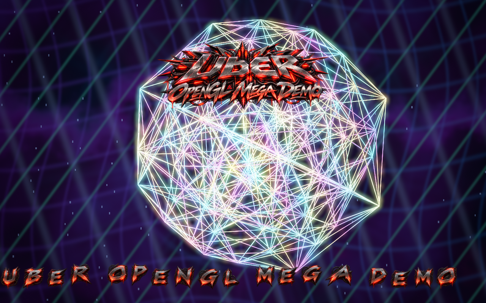

# macOS Impossible Wireframe

C++20 / OpenGL 4.1 Core wireframe demoscene for macOS, focused on mathematically unusual geometry, HDR-style shader compositing, and tracker-music-reactive motion. The project packages the audited impossible-wireframe design as a standalone public repo with tests, provenance, screenshots, and bundled demo music.

All implemented GPU effects are enabled at startup: antialiased, variable-width
3D wires; RGBA16F rendering; thresholded Gaussian bloom; procedural background;
tone mapping; and the first UBER logo with an animated text scroller. The renderer prints
the actual GPU, OpenGL version and target-size limit at launch.

Copyright (c) 2026 Ulf Bertilsson. Code is MIT licensed.


## Screenshots




## Implemented scenes
The show now contains 51 validated scenes. Exact/derived scenes include the
600-cell projection, exact 600-cell face-plane slice and dual-derived 120-cell
projection. Parametric/numerical scenes include TPMS surfaces, Hopf fibres, Boy
surface, superformula, Clifford torus, quaternion-Julia boundary slice,
Lissajous and chaotic attractors, 25 v4 exotic geometry families and 10 ported
unknown-lab procedural wire objects.

`data/object_catalog.csv` records provenance. The hyperbolic and quaternion scenes are visualizations, not claimed canonical honeycomb/fractal meshes.

## Build
macOS (Homebrew):
```sh
brew install cmake glfw sdl2 libopenmpt pkg-config
cmake -S . -B build -DCMAKE_BUILD_TYPE=Release
cmake --build build -j
ctest --test-dir build --output-on-failure
./build/impossible_wireframe --bpm 132
```
Linux: install a C++20 compiler, CMake, OpenGL development headers and GLFW3 development package, then use the same CMake commands.

SDL2 and libopenmpt development packages enable music on Linux. The current GPU
validation was run on Apple M1 Pro, OpenGL `4.1 Metal - 91.7`; Linux GPU execution
has not been verified in this audit. A working window server is needed to run
the demo, even when a test window is hidden.

The executable can also be launched from another working directory: it locates
the copied shaders/assets beside itself. Runtime assets refresh on every build,
including shader-only edits.

If OpenGL/GLFW are absent, CMake still builds `iw_geometry` and `geometry_tests`, allowing headless CI validation.


### First UBER logo and cropped bitmap-font scroller

The demo includes a GPU-composited overlay pass using the supplied UBER metal/red logo art and custom glyph sheet:

- `assets/overlay/logo.png` / `.rgba`: intro logo, pulse-faded over the 3D wireframe scenes.
- `assets/overlay/font.png` / `.rgba`: original glyph sheet. The renderer crops A–Z and 0–9 individually at startup, separates irregular neighbouring outlines and packs them into padded GPU atlas cells. Glyphs retain their native resolution and proportions.
- `assets/overlay/scroller.txt`: editable message with greetings, credits and controls. Supports A–Z, 0–9 and spaces (lowercase becomes uppercase). Text is laid out with per-glyph advances and animated with a subdivided sine ribbon. At a 900-pixel logical window height it travels about 90 logical pixels per second; Retina density and message length do not change that speed.

Only the original red/silver **UBER OpenGL Mega Demo** logo is loaded and drawn.
The alternate logo and greets-card artwork are retained as source assets, but
have no runtime rendering path. The old pre-rendered scroller strip is unused.
Greetings now appear in the text. See [font cropping](docs/FONT.md).

The logo overlay is beat-reactive: chromatic energy, scanline shimmer, edge bloom,
and procedural lightning arcs intensify from the actual HDR wireframe buffer as
well as the music pulse, so bright geometry makes the branding flash and flare.
Its scale follows a smoothed music envelope with a fast attack and slower release,
giving kick hits a visible push without causing jitter between audio frames.
During the opening half-minute the mark travels in depth by breathing toward and away
from the wireframe; it then fades cleanly so the geometry and scroller take over.
Its base width is tied to the wireframe’s live model scale and camera zoom, keeping
the logo and object in the same visual size relationship across scene changes.
The mark rotates about its own centre in pixel space. Overlay glow and lightning
sample the wireframe at the same screen location; logo UVs no longer sample an
unrelated part of the scene. Alpha fades apply to the glow as well as the artwork.

The supplied source artwork is preserved under `assets/branding/`. Runtime RGBA8
derivatives are used so the executable does not need a PNG decoder.

The runtime uses dependency-free `.rgba` texture files generated from the PNG artwork, so packaged builds do not need image-decoder libraries. CMake copies `assets/` and `shaders/` next to the executable after build.

## Controls

- Left / Right: previous / next scene and enter manual scene mode
- Space: return to automatic beat/bar scene sequencing
- B: toggle bloom
- G: toggle procedural background
- O: toggle the first logo and scroller
- D: toggle depth testing / wire x-ray view
- `+` / `-`: exposure, clamped to 0.1–4
- `[` / `]`: wire width, clamped to 1–12 framebuffer pixels before music modulation
- Escape: quit
- `--bpm N`: synchronization tempo (default 132)

The window title reports scene, bloom, depth, exposure and line width. All scene
navigation wraps, including Left from scene zero.

```sh
# Full show, with music and all effects enabled
./build/impossible_wireframe

# Inspect one 3D object without branding or procedural background
./build/impossible_wireframe --scene 9 --no-overlays --no-background --line-width 2

# A bounded, silent runtime check
./build/impossible_wireframe --frames 180 --no-music

# Compare the x-ray view and a lower exposure
./build/impossible_wireframe --scene 6 --xray --exposure 0.7
```

`--no-bloom`, `--no-background`, `--no-overlays` and `--no-music` are independent.
`--help` lists all options; malformed numbers, missing values and unknown options
exit with an error. Renderer/upload failures also return a nonzero exit status.

## Music

The repo includes Drozerix — **Silicon Dancer** (`MOD`), listed by the Quinlight Audio project as Public Domain, for immediate local playback. The fetcher can refresh the same file if needed:

```sh
python3 assets/music/fetch_other_music.py
./build/impossible_wireframe --music assets/music/drozerix_-_silicon_dancer.mod --bpm 132
```

When SDL2 and libopenmpt are available, the module plays locally and its decoded energy drives line glow, bloom intensity, timeline seconds, and background motion. Without those dependencies, the demo remains deterministic from its BPM clock.

The module repeats, while the sample-count transport continues monotonically,
so a song loop does not reset the scene sequence or freeze the scroller.

## Correctness gates
Project targets compile with `-Wall -Wextra -Wpedantic -Werror` (or `/W4 /WX`). Tests assert canonical V/E/F counts for tesseract, 16-cell, 24-cell, 600-cell and V/E for the dual 120-cell; exercise every procedural family; reject non-finite vertices, invalid indices, self-edges and duplicate edges; and verify timeline beat/bar math.

GPU tests are opt-in because CI may not have a window server:

```sh
cmake -S . -B build -DIW_GPU_TESTS=ON
cmake --build build -j
ctest --test-dir build --output-on-failure

# Optional PPM framebuffer capture, using the same validation executable
(cd build && ./renderer_tests gpu-preview.ppm)
```

The GPU test renders all 51 scenes, reads pixels back, checks finite visible
output, compares feature-on/off images, resizes targets, exercises near-plane
clipping and rejects invalid render input. It also destroys and reinitializes the
renderer. Geometry tests cover cache revisions and seed changes to prevent stale
GPU meshes. These checks establish the tested behaviour, not universal correctness
on untested drivers. See [GPU audit](docs/GPU_AUDIT.md) for scope and limitations.

## Architecture
- `Geometry.*`: canonical polychora, projections, slicing, base parametric surfaces, validation.
- `AdvancedGeometry.*`: TPMS extraction, dual 120-cell, quaternion boundary lattice, hyperbolic visualization, attractors, v4 exotic families, unknown-lab adapters and deterministic discovery.
- `Scene.*`: scene catalogue, provenance and update-rate cache. Expensive implicit/fractal geometry is not rebuilt at video refresh rate.
- `Timeline.*`: deterministic BPM/beat/bar synchronization.
- `Renderer.*`: OpenGL 4.1 indexed wire renderer, streamed buffers, checked shader/FBO lifecycle, HDR targets, bloom, overlays and camera choreography.
- `shaders/post.*`: RGBA16F HDR-style composite pass with procedural background,
  glimmer, linear-to-sRGB tone mapping and music-reactive light.
- `shaders/wire.*`: object-space wire color cycling, lighting-matrix bands and
  music-reactive electric edge highlights.
- `shaders/wire.geom`: near-plane clipping and screen-space antialiased ribbons.
- `shaders/bloom.frag`: half-resolution, four-pass separable HDR Gaussian blur.
- `shaders/overlay.*`: centred logo rotation, HDR-linked glow and sine scroller.
- `BitmapFont.*`: irregular glyph cropping and padded atlas construction, with no changes to the original artwork.

See `design.md` for mathematical provenance and design constraints.
See `docs/EFFECTS.md` for the implemented effect catalogue.
