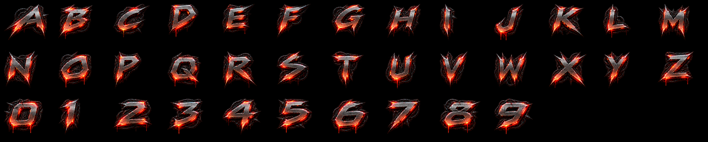

# Bitmap-font cropping



The supplied 1983×793 font sheet has irregular glyph widths and spacing. Treating
it as a fixed grid clipped letters and included neighbouring strokes. The demo
now reads the original RGBA sheet and constructs a clean atlas at startup.

`BitmapFont.cpp` defines the actual row and letter boundaries. Within narrow
boundary corridors it follows low-alpha seams, allowing adjacent italic letters
to overlap horizontally without becoming part of each other's crops. Each glyph
is tightly bounded, copied at original resolution, and surrounded by a 16-pixel
transparent gutter. The original PNG/RGBA artwork is preserved unchanged.

The renderer lays out each letter using its measured width and spacing. Twelve
subdivisions per glyph let the sine wave bend the geometry while UV coordinates
stay inside the crop. Chromatic separation is disabled for text. Mipmap levels
are limited so their footprints remain within the transparent gutters.

## Edit the message

Change `assets/overlay/scroller.txt` and rebuild. The message supports letters
A–Z, digits 0–9 and spaces; lowercase is normalized. Newlines become spaces.
Punctuation is intentionally rejected because this atlas currently maps only
the 36 alphanumeric glyphs. Limit: 4096 characters.

```text
UBER OPENGL MEGA DEMO   GREETS TO AGAR RUNAR STIAN THOMAS AND IVAN
```

The first red/silver UBER logo is the only logo used in the show. The previous
greets card, alternate logo and pre-rendered scroller files remain archived in
the asset directory but are never loaded by the renderer.

## Validate the crops

```sh
./build/font_tests assets/overlay/font.rgba font-proof.ppm
```

This checks all 36 glyphs, transparent filtering gutters and malformed source
input. The optional PPM output shows the exact atlas sent to the GPU. The
renderer tests also validate the cropped font in the real OpenGL overlay pass.
